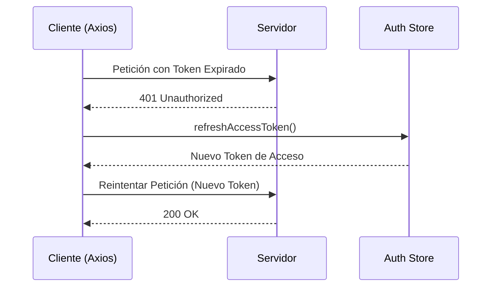

# Configuración de Axios e Interceptores

El archivo `src/api/axios.js` es el punto central de comunicación con el backend. Aquí se configura la instancia de Axios, los interceptores de peticiones y respuestas, y la lógica de refresco de tokens.

## ⚙️ Configuración Base

| Parámetro | Valor |
| :--- | :--- |
| `baseURL` | Definido en `.env` vía `import.meta.env.VITE_API_URL` |
| `timeout` | 10,000 ms (10 segundos) |
| `headers` | `Content-Type: application/json` |

---

## 🛰 Interceptor de Peticiones (`Request Interceptor`)

Este interceptor se ejecuta antes de cada petición saliente. Su función principal es **inyectar el token de acceso** en el encabezado `Authorization`.

- **Ubicación del Token**: Recupera los datos de `localStorage.getItem("auth")`.
- **Formato**: `Authorization: Bearer <token>`.
- **Manejo de Errores**: Si el JSON del token está corrupto, la petición se envía sin el encabezado.

---

## 🔄 Interceptor de Respuestas (`Response Interceptor`)

Maneja las respuestas del servidor y gestiona automáticamente los errores de autenticación (**401 Unauthorized**).

### Lógica de Refresco de Tokens

Si una petición falla con un código `401` y no es una ruta de `/auth/login` o `/auth/refresh`, el sistema intenta refrescar el token automáticamente:

1. **Cola de Peticiones Pendientes**: Mientras el token se está refrescando, las peticiones entrantes se encolan para ser ejecutadas una vez se obtenga el nuevo token.
2. **Refresco con `authStore`**: Llama al método `refreshAccessToken()` del store de autenticación (`@/stores/auth`).
3. **Reintento Automático**: Si el refresco es exitoso, se actualiza el token en la petición original y se reintenta automáticamente.
4. **Fallo Crítico**: Si el refresco falla (el refresh token expiró), el usuario es redirigido a `/login`.

### 📋 Estados del Refresco

| Variable | Descripción |
| :--- | :--- |
| `isRefreshing` | Flag booleano para evitar múltiples llamadas de refresco simultáneas. |
| `pendingQueue` | Arreglo que almacena las peticiones en espera mientras se refresca el token. |

---

## ⚠️ Consideraciones de Seguridad
- **Protección de Rutas**: Las rutas `/auth/login` y `/auth/refresh` están excluidas del proceso de refresco automático para evitar bucles infinitos en caso de credenciales inválidas.
