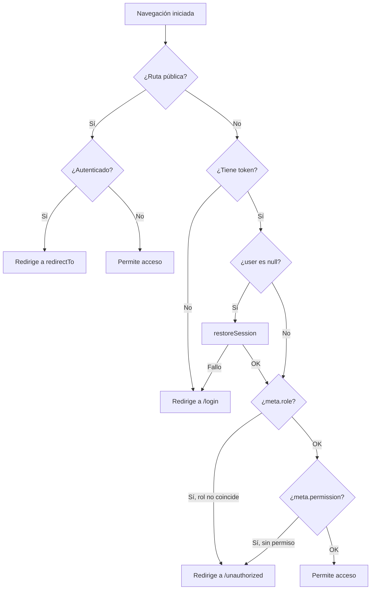

# Guardias de Navegación y Seguridad

El archivo `src/router/guards/authGuards.js` es el responsable de la seguridad de la aplicación a nivel de cliente. Su función es interceptar cada navegación y validar que el usuario tenga autorización para acceder.

## Lógica del `authGuard`

El guardia es **asíncrono** y sigue un flujo de decisión estructurado de 5 pasos:

### Paso 1 — Rutas Públicas

Si la ruta está en `rutasPublicas` (`/login`, `/registro`, `/seleccionsede`, `/unauthorized`) o tiene `meta.public: true`:
- Si el usuario ya está autenticado → Redirige automáticamente a su panel principal (`auth.redirectTo`).
- Si no está autenticado → Permite el acceso normalmente.

### Paso 2 — Verificación de Autenticación

Si el usuario no tiene un token activo en el store:
- Redirige inmediatamente a `/login`.

### Paso 3 — Restauración de Sesión

Si existe un token pero el objeto `user` en el store es `null` (ocurre al recargar la página, ya que solo se persiste el token):
- Ejecuta `auth.restoreSession()` para decodificar el JWT y restaurar los datos del usuario.
- Si la restauración falla (token expirado o inválido) → Redirige a `/login`.

### Paso 4 — Verificación de Rol

Si la ruta define un rol requerido (`meta.role`):
- Compara `auth.role` con el valor esperado (ej: `"admin"`, `"cliente"`).
- Si no coinciden → Redirige a `/unauthorized`.

### Paso 5 — Verificación de Permiso Específico

Si la ruta define un permiso requerido (`meta.permission`):
- Si el usuario tiene `isAdmin` (rol `SUPER-ADMIN` o `ADMIN`) → Acceso garantizado.
- De lo contrario, verifica si el permiso existe en `auth.user.permisos`.
- Si no lo tiene → Redirige a `/unauthorized`.



---

## Parámetros de Ruta (`meta`)

| Propiedad | Tipo | Descripción |
| :--- | :--- | :--- |
| `requiresAuth` | `Boolean` | Indica que la ruta es privada (requiere autenticación). |
| `role` | `String` | El rol exacto permitido (ej: `"admin"`, `"cliente"`). |
| `permission` | `String` | El permiso específico requerido (ej: `"VER-USUARIOS"`). Usar constantes de `PERMS`. |
| `public` | `Boolean` | Si es `true`, omite todas las verificaciones de autenticación. |

```javascript
// Ejemplo de ruta admin con permiso específico
{
  path: "usuarios",
  component: Usuarios,
  meta: {
    requiresAuth: true,
    role: "admin",
    permission: PERMS.ROLES_VER,
  }
}
```

---

## Notas Técnicas

- El guardia utiliza el store de Pinia (`useAuthStore`) para obtener el estado actual de la sesión.
- Los administradores con rol `SUPER-ADMIN` o `ADMIN` tienen **bypass automático** en la verificación de permisos específicos (Paso 5).
- El archivo `src/router/guards/permission.guard.js` existe como referencia auxiliar, pero la lógica de permisos está integrada directamente en `authGuards.js`.
